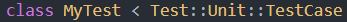
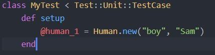
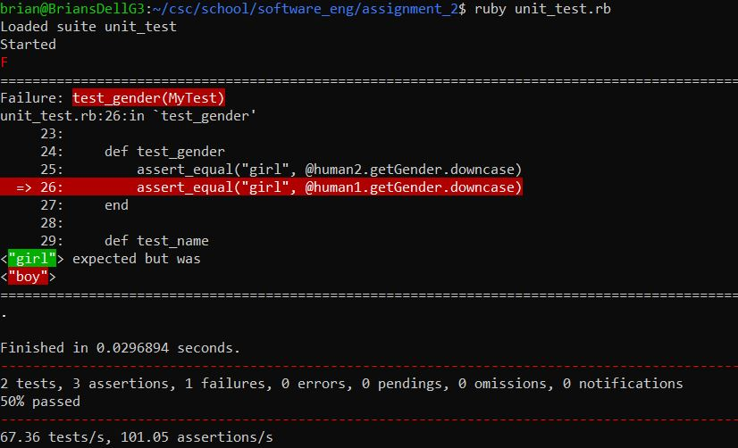

# Ruby Unit Testing Tutorial #
This tutorial provides a hands-on exercise for learning how to perform unit testing with the Test::Unit Ruby framework.
## Setting up a test file: ##
1. Create a new Ruby file for your test(s)
2. Require “test/unit” at the top of your file

	
3. Create a class that inherits from Test::Unit::TestCase

	
4. [Optional] Add parameters to your test class
	- You might be used to creating instance variables within your classes in Ruby, perhaps by using the “initialize” method. However, to create instance variables in a subclass of TestCase, you must define a “setup” method, as shown below:
	
		
## Create tests: ##
1. Make a testing method in your class
	- It is good practice to start the name of your method with the word “test”.
	
		
2. Add assertions to your test method
	- These assert statements within your testing method will be your individual tests. 
	- There are many different types of assert statements you can use. The following example tests if the result of get_num is equal to 5:
	
		
3. Create more test methods and assertion statements
	- You can create as many test methods as you want, and put multiple assertion statements in each method, depending on what kind of testing you need to do. 

## Run your tests: ##
1. Simply run your script as you would any other Ruby script and the Test::Unit framework will do the rest.
See below for an example of the Test::Unit output, which shows that one of our tests has failed:

	
As seen from the terminal output, we can see what value our assert statement expected versus the value it actually received. The specific assertion that failed is also pointed out in our code.
