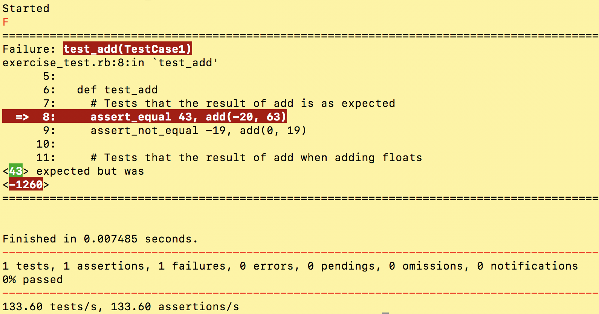

# Ruby Unit Testing Tutorial #
This tutorial provides a hands-on exercise for learning how to perform unit testing with the Test::Unit Ruby framework.

## 1) Get a sample file: ##
To follow along, either download the 'exercise.rb' file, or use your own ruby file with functions that you wish to test.

## 2) Set up a test file: ##
1. Require test/unit at the top of your file, as well as the file with your functions
	- This is all you need to do to use the Test::Unit framework -- it comes pre-installed with Ruby.

	```ruby
	require 'test/unit'
	require './exercise'
	```
## 3) Create your tests: ##
1. Create a test case class

	```ruby
	class MyTestCase < Test::Unit::TestCase
	```
2. Add a test method to your test case
	- It is good practice to start the name of your method with the word “test”.

	```ruby
	class MyTestCase < Test::Unit::TestCase

	  def test_add
	    # testing the 'add' function
	  end
	end
	```
3. Add assertions to your test method. These assert statements within your testing method will be your individual tests.

	```ruby
	class MyTestCase < Test::Unit::TestCase

	  def test_add
	    assert_equal 43, add(-20, 63)
	    assert_not_equal -19, add(0, 19)
	  end
	end
	```
4. Create more test methods and assertion statements

	```ruby
	class MyTestCase < Test::Unit::TestCase

	  def test_add
	    assert_equal 43, add(-20, 63)
	    assert_not_equal -19, add(0, 19)
	  end

	  def test_subtract
	    assert_equal 2, subtract(30, 28)
	    assert_not_equal -6, subtract(0, -6)
	  end
	end
	```

## 4) Run your tests: ##
Simply run your test script as you would any other Ruby script and the Test::Unit framework will do the rest.
See below for an example of the Test::Unit output, which shows that one of our tests has failed:


As seen from the terminal output, we can see what value our assert statement expected versus the value it actually received. The specific assertion that failed is also pointed out in our code.

### More examples ###
For more examples, check out the files in the 'examples' folder.
